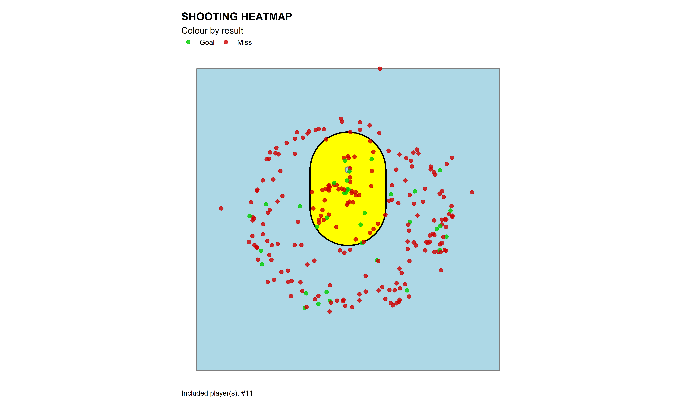
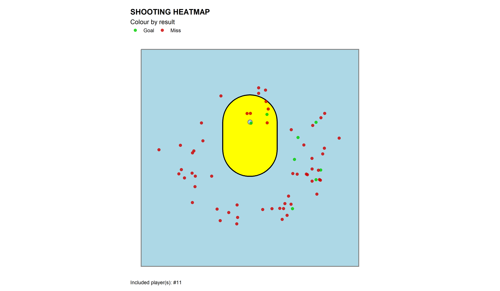

<!-- README.md is generated from README.Rmd. Please edit that file -->

# TagR

<!-- badges: start -->

<!-- badges: end -->

TagR helps you work with “tagged shots” from the popular TeamTV analysis
platform, mainly used in korfball. It includes:

- Functions to tell you what information you miss.
- Various visualisations of tagged shots.
- Dashboards to compare and analyse teams and individual players at a
  glance.

## Installation

You can install the development version of TagR from GitHub with:

``` r
# install.packages("pak")
pak::pak("EmmaDirk/TagR")
```

## Data format

TagR functions expect a TeamTV shot export with the same structure as
the example dataset shipped with the package:

``` r
library(TagR)

str(shots, 1)
#> 'data.frame':    1196 obs. of  37 variables:
#>  $ X                          : int  0 1 2 3 4 5 6 7 8 9 ...
#>  $ sporting_event_id          : chr  "99d26597-de62-4b4d-8460-1ac4413c914b" "99d26597-de62-4b4d-8460-1ac4413c914b" "99d26597-de62-4b4d-8460-1ac4413c914b" "99d26597-de62-4b4d-8460-1ac4413c914b" ...
#>  $ sporting_event_name        : chr  "PKC - DOS" "PKC - DOS" "PKC - DOS" "PKC - DOS" ...
#>  $ sporting_event_scheduled_at: chr  "2024-06-26 13:45:59.671166+00:00" "2026-11-29 02:40:56.514540+00:00" "2025-01-14 17:40:29.063786+00:00" "2024-01-23 18:51:03.476285+00:00" ...
#>  $ observation_id             : chr  "f8ecebfe-e130-4c6f-bfb6-cffdfdd75dce" "6b0df560-ec7c-454e-8b43-f697eff11689" "cf9c3e9e-a464-4833-8a0d-554ce57131a9" "9ce1db60-218a-4791-bc6c-b49ae73c2eee" ...
#>  $ clock_id                   : chr  "R2" "R2" "R2" "R2" ...
#>  $ start_time                 : int  2523 4270 388 1949 2844 4270 1619 2529 3702 2418 ...
#>  $ end_time                   : int  2523 4270 388 1949 2844 4270 1619 2529 3702 2418 ...
#>  $ code                       : chr  "SHOT" "SHOT" "SHOT" "SHOT" ...
#>  $ description                : chr  "Shot: MISS" "Shot: MISS" "Shot: MISS" "Shot: MISS" ...
#>  $ possession_id              : chr  "99d26597-de62-4b4d-8460-1ac4413c914b:00000" "99d26597-de62-4b4d-8460-1ac4413c914b:00000" "99d26597-de62-4b4d-8460-1ac4413c914b:00000" "99d26597-de62-4b4d-8460-1ac4413c914b:00000" ...
#>  $ team_id                    : chr  "59a9d50c-b35c-4cc4-8af5-ec7edd2be840" "59a9d50c-b35c-4cc4-8af5-ec7edd2be840" "59a9d50c-b35c-4cc4-8af5-ec7edd2be840" "59a9d50c-b35c-4cc4-8af5-ec7edd2be840" ...
#>  $ team_name                  : chr  "Fortuna" "Fortuna" "Fortuna" "Fortuna" ...
#>  $ team_ground                : chr  "home" "home" "home" "home" ...
#>  $ position                   : chr  "ATTACK" "ATTACK" "ATTACK" "ATTACK" ...
#>  $ team_name_full             : chr  "Fortuna" "Fortuna" "Fortuna" "Fortuna" ...
#>  $ team_key                   : chr  "fortuna" "fortuna" "fortuna" "fortuna" ...
#>  $ person_id                  : chr  "ce3da71f-8020-4b9e-b3b7-3ddd1c287c14" "823dd5e8-c6de-4767-8abe-cfa121f569f6" "823dd5e8-c6de-4767-8abe-cfa121f569f6" "ce3da71f-8020-4b9e-b3b7-3ddd1c287c14" ...
#>  $ first_name                 : chr  "Joost" "Noa" "Noa" "Joost" ...
#>  $ last_name                  : chr  "Dekker" "Vos" "Vos" "Dekker" ...
#>  $ number                     : chr  "11" "1" "1" "11" ...
#>  $ full_name                  : chr  "Joost Dekker" "Noa Vos" "Noa Vos" "Joost Dekker" ...
#>  $ leg                        : chr  "LEFT" "onbekend" "LEFT" "LEFT" ...
#>  $ type                       : chr  "LONG" "RUNNING-IN" "SHORT" "LONG" ...
#>  $ angle                      : num  -148.1 46.9 155.2 -142.9 137.6 ...
#>  $ result                     : chr  "MISS" "MISS" "MISS" "MISS" ...
#>  $ distance                   : num  6.4 2.4 5.4 5.7 5.2 5.7 7 5.7 5.6 5.2 ...
#>  $ pressure                   : chr  "MEDIUM" "NONE" "MEDIUM" "MEDIUM" ...
#>  $ x                          : num  3.38 -1.75 -2.27 3.44 -3.51 ...
#>  $ y                          : num  -5.43 1.64 -4.9 -4.55 -3.84 ...
#>  $ participantsPersonIds      : logi  NA NA NA NA NA NA ...
#>  $ opponent_person_id         : chr  "onbekend" "onbekend" "onbekend" "onbekend" ...
#>  $ opponent_first_name        : chr  "onbekend" "onbekend" "onbekend" "onbekend" ...
#>  $ opponent_last_name         : chr  "onbekend" "onbekend" "onbekend" "onbekend" ...
#>  $ opponent_number            : chr  "onbekend" "onbekend" "onbekend" "onbekend" ...
#>  $ opponent_full_name         : chr  "onbekend" "onbekend" "onbekend" "onbekend" ...
#>  $ shot_count                 : int  1 2 3 4 1 1 2 3 4 1 ...
```

## Missingness patterns

A quick way to see what information you have, and what information you
have not yet recorded.

``` r
# example: plot missingness pattern for all shots
p <- tagr_plot_missingness(shots)
p
```


## Shot visualisations by location

TagR includes visualisations of shot location, where various attributes
of the shots can be mapped to colour.

``` r
# example: result-colored plot (GOAL vs MISS) 
p <- tagr_heatmap(shots, colour_by = "result")
p
```


Like many other functions in this package, plotting functions accept an
optional `player` argument (fuzzy match on name or exact match on
number).

``` r
# example: plot shots for player number 11 only
p <- tagr_heatmap(shots, colour_by = "result", player = "11")
p
```



Included shots can also be filtered by `type` (e.g., exclude freeballs),
`result` (i.e. goal or miss), `pressure` level and `leg`.

``` r
# example: plot right legged shots for player number 11 only
p <- tagr_heatmap(shots, colour_by = "result", player = "11", filter = list(leg = "RIGHT"))
p
```



## Team dashboards

TagR provides quick overviews of team shooting performance across
various attributes, including `pressure`, `distance`, shot `type`,
`leg`, and `shot count band`. Ideal for coaches to get a quick sense of
team performance and identify areas for improvement, or identify threats
when preparing for upcoming opponents.

``` r
# example: team overview dashboard
p <- tagr_team_dashboad(shots)
p
```


## Player dashboards

Or zoom in on individual players to see their shooting performance
across various attributes, compared to the team average.

``` r
# example: player overview dashboard for player number 10
p <- tagr_player_dashboard(shots, player = "17")
p
```


## Player analysis

TagR provides simple visualizations to show how scoring probability
changes with:

- `distance` (capped at 10 m)
- `pressure` (NONE \< MEDIUM \< HIGH)
- `shot count band` (1, 2, 3, 4+)

This can provide coaches with a simple way to view if players are
struggling under pressure, or from longer distances.

``` r
# example: plot scoring probability by pressure for player number 10
p <- tagr_shot_analysis(shots, player = "10", feature = "pressure", add_team = TRUE)
p
```


where `feature` can also be `"distance"` or `"shot_count_band"`.
Multiple players can be added by passing a vector to the `player`
argument:

``` r
# example: plot scoring probability by distance for player number 10
p <- tagr_shot_analysis(shots, player = c("10", "17"), feature = "distance", add_team = TRUE)
p
```


