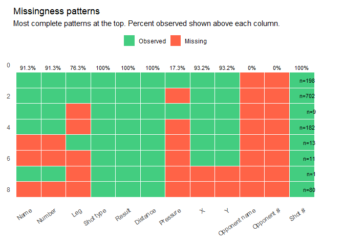
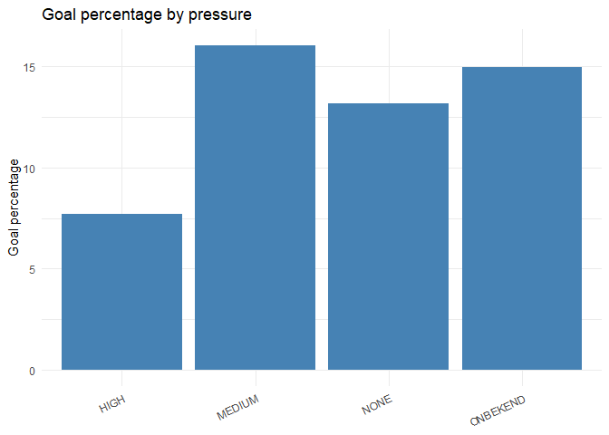
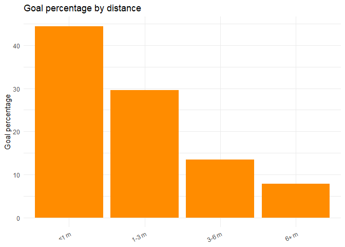
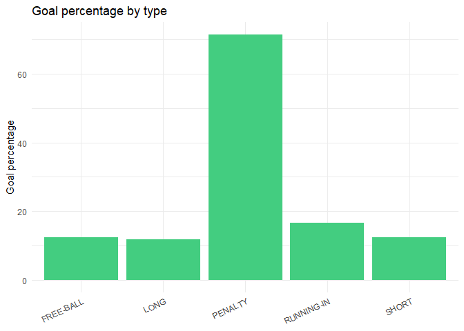
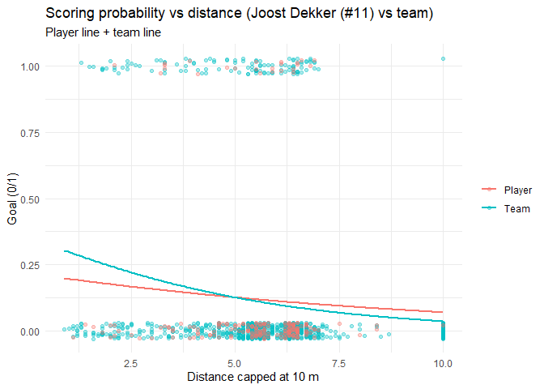
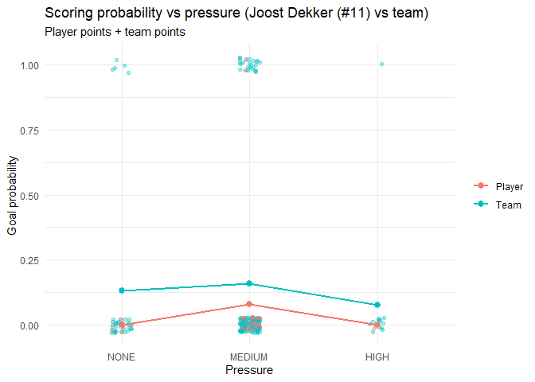
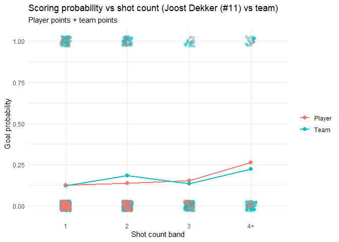

<!-- README.md is generated from README.Rmd. Please edit that file -->

# TagR

<!-- badges: start -->

<!-- badges: end -->

TagR helps you work with TeamTV “tagged shots” exports for korfball. It
provides:

- strict input validation for TeamTV shot exports (column names, types,
  and coding levels)
- quick quality checks (missingness patterns)
- shot location visualizations on a korfball half-field
- team descriptives tables + plots for coaching dashboards
- simple per-player analysis plots (binomial trends for distance,
  pressure, and shot count)
- a leg preference slider for comparing players at a glance

## Installation

You can install the development version of TagR from GitHub with:

``` r
# install.packages("pak")
pak::pak("EmmaDirk/TagR")
```

## Data format

Most TagR functions expect a TeamTV shot export with the same structure
as the example dataset shipped with the package:

``` r
library(TagR)

str(shots, 1)
#> 'data.frame':    1196 obs. of  37 variables:
#>  $ X                          : int  0 1 2 3 4 5 6 7 8 9 ...
#>  $ sporting_event_id          : chr  "99d26597-de62-4b4d-8460-1ac4413c914b" "99d26597-de62-4b4d-8460-1ac4413c914b" "99d26597-de62-4b4d-8460-1ac4413c914b" "99d26597-de62-4b4d-8460-1ac4413c914b" ...
#>  $ sporting_event_name        : chr  "PKC - DOS" "PKC - DOS" "PKC - DOS" "PKC - DOS" ...
#>  $ sporting_event_scheduled_at: chr  "2024-06-26 13:45:59.671166+00:00" "2026-11-29 02:40:56.514540+00:00" "2025-01-14 17:40:29.063786+00:00" "2024-01-23 18:51:03.476285+00:00" ...
#>  $ observation_id             : chr  "f8ecebfe-e130-4c6f-bfb6-cffdfdd75dce" "6b0df560-ec7c-454e-8b43-f697eff11689" "cf9c3e9e-a464-4833-8a0d-554ce57131a9" "9ce1db60-218a-4791-bc6c-b49ae73c2eee" ...
#>  $ clock_id                   : chr  "R2" "R2" "R2" "R2" ...
#>  $ start_time                 : int  2523 4270 388 1949 2844 4270 1619 2529 3702 2418 ...
#>  $ end_time                   : int  2523 4270 388 1949 2844 4270 1619 2529 3702 2418 ...
#>  $ code                       : chr  "SHOT" "SHOT" "SHOT" "SHOT" ...
#>  $ description                : chr  "Shot: MISS" "Shot: MISS" "Shot: MISS" "Shot: MISS" ...
#>  $ possession_id              : chr  "99d26597-de62-4b4d-8460-1ac4413c914b:00000" "99d26597-de62-4b4d-8460-1ac4413c914b:00000" "99d26597-de62-4b4d-8460-1ac4413c914b:00000" "99d26597-de62-4b4d-8460-1ac4413c914b:00000" ...
#>  $ team_id                    : chr  "59a9d50c-b35c-4cc4-8af5-ec7edd2be840" "59a9d50c-b35c-4cc4-8af5-ec7edd2be840" "59a9d50c-b35c-4cc4-8af5-ec7edd2be840" "59a9d50c-b35c-4cc4-8af5-ec7edd2be840" ...
#>  $ team_name                  : chr  "Fortuna" "Fortuna" "Fortuna" "Fortuna" ...
#>  $ team_ground                : chr  "home" "home" "home" "home" ...
#>  $ position                   : chr  "ATTACK" "ATTACK" "ATTACK" "ATTACK" ...
#>  $ team_name_full             : chr  "Fortuna" "Fortuna" "Fortuna" "Fortuna" ...
#>  $ team_key                   : chr  "fortuna" "fortuna" "fortuna" "fortuna" ...
#>  $ person_id                  : chr  "ce3da71f-8020-4b9e-b3b7-3ddd1c287c14" "823dd5e8-c6de-4767-8abe-cfa121f569f6" "823dd5e8-c6de-4767-8abe-cfa121f569f6" "ce3da71f-8020-4b9e-b3b7-3ddd1c287c14" ...
#>  $ first_name                 : chr  "Joost" "Noa" "Noa" "Joost" ...
#>  $ last_name                  : chr  "Dekker" "Vos" "Vos" "Dekker" ...
#>  $ number                     : chr  "11" "1" "1" "11" ...
#>  $ full_name                  : chr  "Joost Dekker" "Noa Vos" "Noa Vos" "Joost Dekker" ...
#>  $ leg                        : chr  "LEFT" "onbekend" "LEFT" "LEFT" ...
#>  $ type                       : chr  "LONG" "RUNNING-IN" "SHORT" "LONG" ...
#>  $ angle                      : num  -148.1 46.9 155.2 -142.9 137.6 ...
#>  $ result                     : chr  "MISS" "MISS" "MISS" "MISS" ...
#>  $ distance                   : num  6.4 2.4 5.4 5.7 5.2 5.7 7 5.7 5.6 5.2 ...
#>  $ pressure                   : chr  "MEDIUM" "NONE" "MEDIUM" "MEDIUM" ...
#>  $ x                          : num  3.38 -1.75 -2.27 3.44 -3.51 ...
#>  $ y                          : num  -5.43 1.64 -4.9 -4.55 -3.84 ...
#>  $ participantsPersonIds      : logi  NA NA NA NA NA NA ...
#>  $ opponent_person_id         : chr  "onbekend" "onbekend" "onbekend" "onbekend" ...
#>  $ opponent_first_name        : chr  "onbekend" "onbekend" "onbekend" "onbekend" ...
#>  $ opponent_last_name         : chr  "onbekend" "onbekend" "onbekend" "onbekend" ...
#>  $ opponent_number            : chr  "onbekend" "onbekend" "onbekend" "onbekend" ...
#>  $ opponent_full_name         : chr  "onbekend" "onbekend" "onbekend" "onbekend" ...
#>  $ shot_count                 : int  1 2 3 4 1 1 2 3 4 1 ...
```

## Missingness patterns

A quick way to see what information you do, and do not have.

``` r
p <- tagr_plot_missingness(shots)
p
```



## Shot location plots

TagR includes visualisations of shot location, filtered in various ways.

``` r
# Example: result-colored plot (GOAL vs MISS) 
p <- tagr_plot_shots_result(shots)
p
```

Like many other functions in this package, plotting functions accept an
optional `player` argument (fuzzy match on name or exact match on
number).

``` r
# Example: plot shots for player number 11 only
p <- tagr_plot_shots_pressure(shots, player = "11")
p
```

## Team descriptives (tables + plots)

Compute goal percentages by key categories (pressure, distance band,
shot type, shot count band, leg). Returns plain data.frames so they are
easy to inspect and test.

``` r
tabs <- tagr_team_overview_tables(shots)

names(tabs)
#> [1] "pressure"   "distance"   "type"       "shot_count" "leg"
tabs$pressure
#> # A tibble: 4 × 4
#>   level    shots goals pct_goal
#>   <chr>    <int> <int>    <dbl>
#> 1 ONBEKEND   989   148    15.0 
#> 2 MEDIUM     156    25    16.0 
#> 3 NONE        38     5    13.2 
#> 4 HIGH        13     1     7.69
tabs$type
#> # A tibble: 5 × 4
#>   level      shots goals pct_goal
#>   <chr>      <int> <int>    <dbl>
#> 1 LONG         632    56     8.86
#> 2 SHORT        378    59    15.6 
#> 3 RUNNING-IN   112    22    19.6 
#> 4 FREE-BALL     39    14    35.9 
#> 5 PENALTY       35    28    80
```

Plot one attribute as a quick bar chart:

``` r
tagr_team_overview_plot(shots, attribute = "pressure")
```



``` r
tagr_team_overview_plot(shots, attribute = "distance")
```



Filter to a single player (fuzzy match on name or exact match on
number):

``` r
tagr_team_overview_plot(shots, attribute = "type", player = "11")
```



## Player analysis (binomial trend plots)

TagR provides simple visualizations to show how scoring probability
changes with: - distance (capped at 10 m) - pressure (NONE \< MEDIUM \<
HIGH) - shot count band (1, 2, 3, 4+)

Player plots optionally include the team line/points for comparison, and
you can restrict to LONG/SHORT shots only, including only shots from
open play.

``` r
tagr_plot_prob_by_distance(shots)
```


``` r
tagr_plot_prob_by_distance(shots, player = "11", long_short_only = TRUE)
```



``` r

tagr_plot_prob_by_pressure(shots, player = "Joost Dek")
```



``` r
tagr_plot_prob_by_shot_count(shots, player = "11")
```



## Leg preference slider

A compact visualization that places all players on a left-to-right “leg
preference” slider. It uses only SHORT, LONG, and FREE-BALL shots and
combines volume and success per leg. The y-axis shows number of shots,
and each dot is labeled with the player name/number.

``` r
tagr_plot_leg_preference_slider(shots)
#> Warning in ggplot2::geom_segment(ggplot2::aes(x = -1, xend = 1, y = 0, yend = 0), : All aesthetics have length 1, but the data has 11 rows.
#> ℹ Please consider using `annotate()` or provide this layer with data containing
#>   a single row.
```


